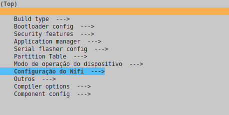
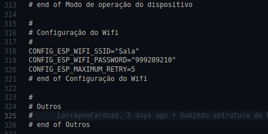
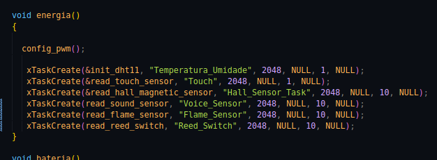

# Fundamentos de Sistemas Embarcados (FSE)
## [Trabalho Final - 2022/2](https://gitlab.com/fse_fga/trabalhos-2022_2/trabalho-final-2022-2)
</br>

## Alunos

| Nome | Matrícula  |
| :- | :- |
| Gustave Augusto Persijn | 19/0046091 |
| João Victor  | 19/0109963 |
| Lorrayne Alves Cardozo | 19/0032863 |


## Sensores 
|  |   |
| :-: | :- |
| DHT11 | Temperatura e Umidade |
| KY036  | Toque |
| KY038  | Voz |
| KY003  | Hall Magnético |
| KY026  | Detector de Chama |
| KY024  | Reed Switch |


## Dashboard


## Instruções 
Para instalar o projeto, bastar seguir os seguintes comandos:
```
$ git clone https://github.com/LorrayneCardozo/FSE-FINAL_Joao_Gustave_Lorrayne.git
```
Em seguida, configure a conexão Wifi. Caso esteja utilizando a PlatformIO, você pode fazer isso entrando na pasta raiz do projeto e rodando o comando
```
$ pio run -t menuconfig
```
e informando o nome da rede wifi conectado e senha no menu que aparecerá em seguida


Ou alterando os campos `CONFIG_ESP_WIFI_SSID` e `CONFIG_ESP_WIFI_PASSWORD` no arquivo `sdkconfig.esp32doit-devkit-v1`



Para escolher quais sensores testar, basta comentar/descomentar as chamadas das tasks de cada sensor no arquivo `modo_operacao.c`



Por fim basta realizar o build do projeto e executar o upload para a placa conectada

## Apresentação
[Link do vídeo de apresentação](https://youtu.be/3A2mMw1C4Ew)
