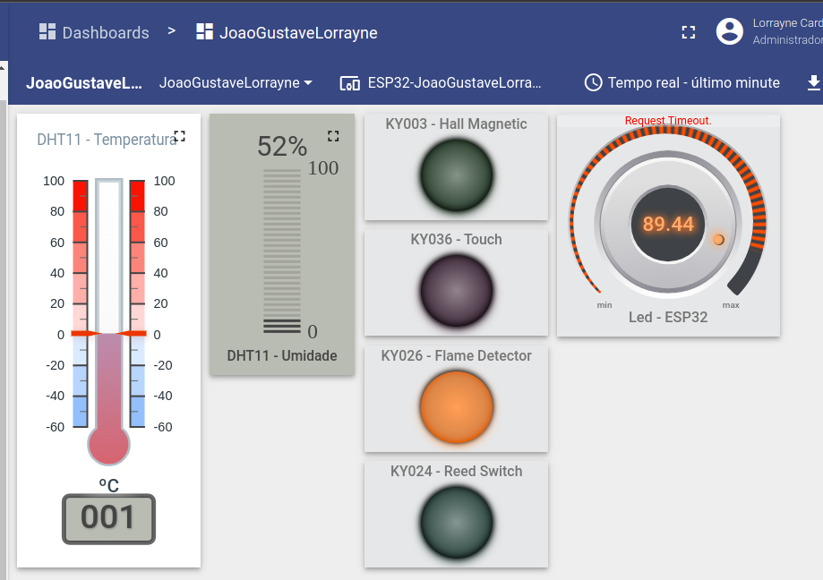

# Fundamentos de Sistemas Embarcados (FSE)
## [Trabalho Final - 2022/2](https://gitlab.com/fse_fga/trabalhos-2022_2/trabalho-final-2022-2)
 

## Alunos

| Nome | Matrícula  |
| :- | :- |
| Gustave Augusto Persijn | 19/0046091 |
| João Victor  | 19/0109963 |
| Lorrayne Alves Cardozo | 19/0032863 |

## Sensores 
|  |   |
| :-: | :- |
| DHT11 | Temperatura e Umidade |
| KY036  | Toque |
| KY038  | Voz |
| KY003  | Hall Magnético |
| KY026  | Detector de Chama |
| KY024  | Reed Switch |

## Dashboard

## Apresentação
[Link do vídeo de apresentação]()